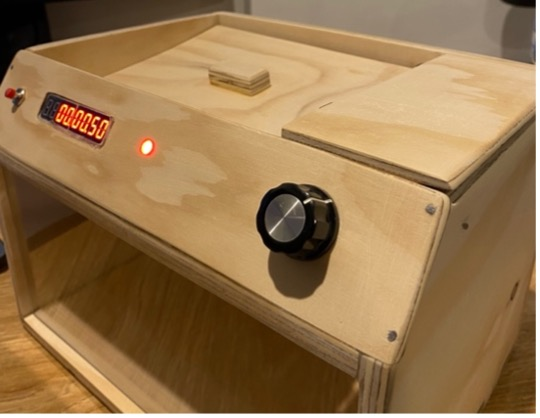
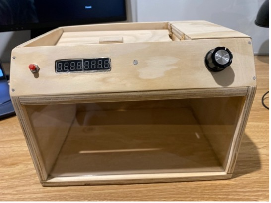

# Timed Lock Box
Arduino Nano-powered timed lock box.

## Functionality
1. Place item to be locked away in box & close the lid
2. Using the dial - set a time (in 5 minute increments) between 5 mins & 2 hours
3. Push button to activate lock & begin countdown
4. Watch the time countdown on the display
5. Once the timer runs out, the box will be unlocked

## Photos

## Video Demonstration
[Unlocking Demonstration](videos/UNLOCKING.MOV)

[Locking Demonstration](videos/LOCKING.MOV)

## Arduino Nano Circuit Diagram

## Process Explanation
[Documentation of process & challenges](documentation.pdf)
